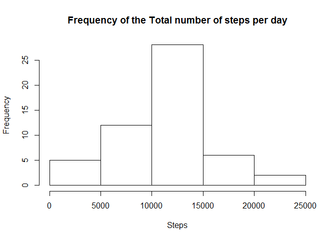
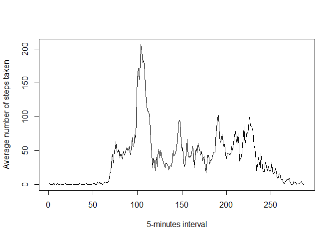
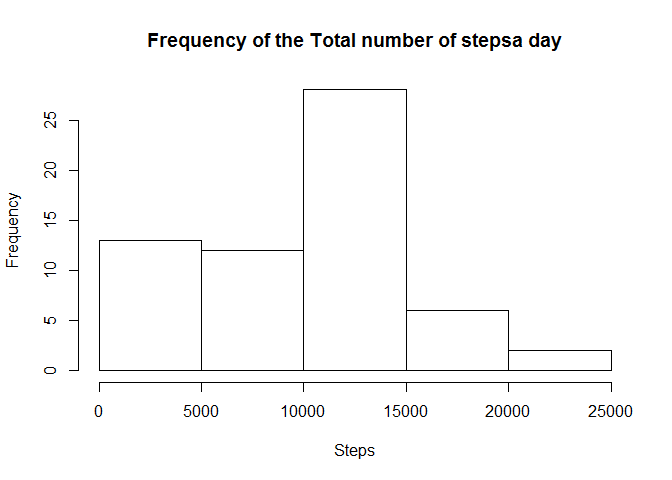
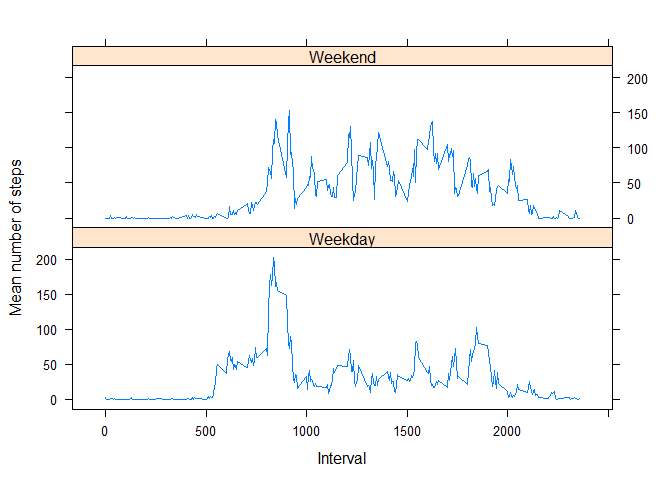

# Reproducible Research: Peer Assessment 1


## Loading and preprocessing the data
*Steps:*

* setting the working directory

* Unzziping the file directly from the Working directory

* Read the data 

* format the date variable


```r
setwd("~/RepData_PeerAssessment1")
unz("activity", "activity.csv")
activity <- read.csv("activity.csv")
activity$date <- as.Date(activity$date, "%Y-%m-%d")
```

* Check that the variables are ready for exploratory analysis


```r
str(activity)
```

```
## 'data.frame':	17568 obs. of  3 variables:
##  $ steps   : int  NA NA NA NA NA NA NA NA NA NA ...
##  $ date    : Date, format: "2012-10-01" "2012-10-01" ...
##  $ interval: int  0 5 10 15 20 25 30 35 40 45 ...
```

## What is mean total number of steps taken per day?

1. Calculate the total number of steps taken per day


```r
stepsperday<-tapply(activity$steps, activity$date, FUN=sum)
```

2. If you do not understand the difference between a histogram and a barplot, research the difference between them. Make a histogram of the total number of steps taken each day


```r
hist(stepsperday,  main = "Frequency of the Total number of steps per day", xlab = "Steps")
```

 

3. Calculate and report the mean and median of the total number of steps taken per day


```r
stepsmean <- mean(stepsperday, na.rm=TRUE)
stepsmedian <- median(stepsperday, na.rm=TRUE)
```

The mean number of steps per day is **1.0766189\times 10^{4}**

The median number of steps per days is **10765**


## What is the average daily activity pattern?

1. Make a time series plot (i.e. type = "l") of the 5-minute interval (x-axis) and the average number of steps taken, averaged across all days (y-axis)


```r
series <- tapply(activity$steps, activity$interval, FUN=mean, na.rm = TRUE)
plot(series, type = "l", xlab = "5-minutes interval",  ylab = "Average number of steps taken")
```

 

2. Which 5-minute interval, on average across all the days in the dataset, contains the maximum number of steps?


```r
maxiinterval <- names(series)[which.max(apply(series, MARGIN=1,max))]
```


The 5-minute interval where the average of steps is maximum is **835**


## Imputing missing values

1. Calculate and report the total number of missing values in the dataset (i.e. the total number of rows with NAs)


```r
missing<-sum(!complete.cases(activity$steps))
```


The number rows with NAs is **2304**

2. Devise a strategy for filling in all of the missing values in the dataset. The strategy does not need to be sophisticated. For example, you could use the mean/median for that day, or the mean for that 5-minute interval, etc.


```r
missingdata<- which(is.na(activity$steps))
medians <- rep(median(activity$steps, na.rm=TRUE), times=length(missingdata))
```

3. Create a new dataset that is equal to the original dataset but with the missing data filled in.


```r
activity[missingdata, "steps"] <- medians
```

4. Make a histogram of the total number of steps taken each day and Calculate and report the mean and median total number of steps taken per day. Do these values differ from the estimates from the first part of the assignment? What is the impact of imputing missing data on the estimates of the total daily number of steps?


```r
stepsperdaymediansNA<-tapply(activity$steps, activity$date, FUN=sum)
hist(stepsperdaymediansNA,  main = "Frequency of the Total number of stepsa day", xlab = "Steps")
```

 

```r
stepsmean1 <- mean(stepsperdaymediansNA, na.rm=TRUE)
stepsmedian1 <- median(stepsperdaymediansNA, na.rm=TRUE)
```

The new mean number of steps per day is **9354.2295082** when NAs are replaced with the median of the day

The median number of steps per days is **1.0395\times 10^{4}** when NAs are replaced with the median of the day

The distribution isnow more skewed to the left


## Are there differences in activity patterns between weekdays and weekends?

1. Create a new factor variable in the dataset with two levels - "weekday" and "weekend" indicating whether a given date is a weekday or weekend day.


```r
activity1 <- data.frame(activity, weekday=weekdays(activity$date))
activity2 <- cbind(activity1, day = ifelse(activity1$weekday == "Saturday" | activity1$weekday == "Sunday", "Weekend", "Weekday"))
```

2. Make a panel plot containing a time series plot (i.e. type = "l") of the 5-minute interval (x-axis) and the average number of steps taken, averaged across all weekday days or weekend days (y-axis). See the README file in the GitHub repository to see an example of what this plot should look like using simulated data.


```r
meanday <- aggregate(steps ~ interval + day, data = activity2, mean)

library(lattice)
xyplot(steps ~ interval | day,meanday, type="l", xlab="Interval", ylab="Mean number of steps", 
       layout=c(1,2))
```

 
